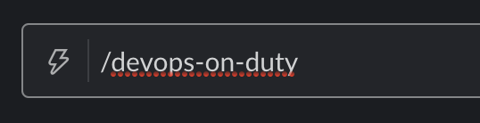
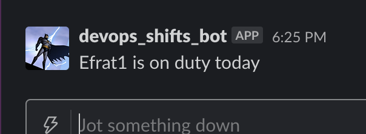
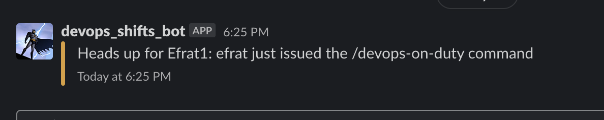

# shifts-scheduler

## What is it

This is a simple task manager to distribute information of any kind from kubernetes configmaps via built-in Slack support
you have a configmap where you schedule shifts, then you register a slack app with slash-command & webhook permissions, and you point it towards your app domain. register a slash-command so when you type in:

 

you get back:

 

plus - you also use the webhook to spy on your users, so you get this message in another channel every time they use the slash command:

 


## Installation

create and apply the shifts configmap:

```yaml
apiVersion: v1
kind: ConfigMap
metadata:
  labels:
    app: devops-shifts-board
  name: devops-shifts-board
  namespace: default
data:
  Sunday: Efrat
  Monday: Johnny
  09-06-2020: Johnny
```
then deploy the operator via helm:
```shell
git clone git@github.com:Efrat19/shifts-scheduler.git
cd chart
kubectl create ns shifts-scheduler
helm install --name shifts-scheduler -f example.yaml
```

## Built With

* [go](https://golang.org/) - Programing language
* [docker](https://www.docker.com/) - Containerized with docker
* [helm](https://www.helm.sh/) - Packaged with helm

## Author

* [Efrat Lavitan](https://github.com/efrat19) - *Initial work*
